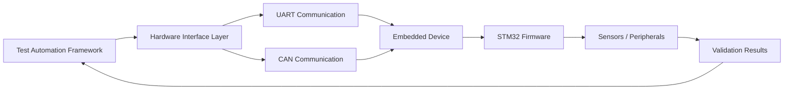
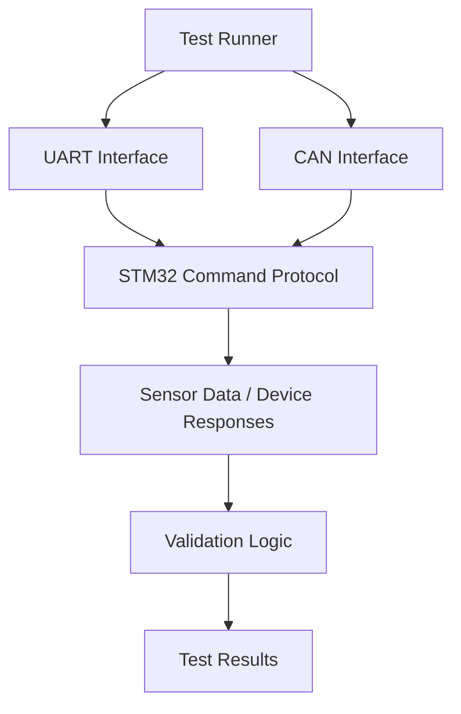
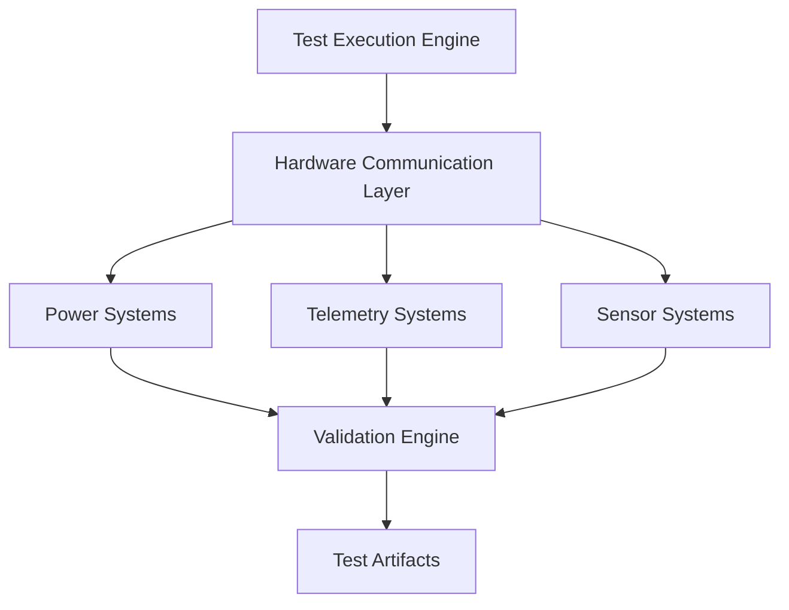
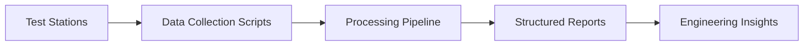
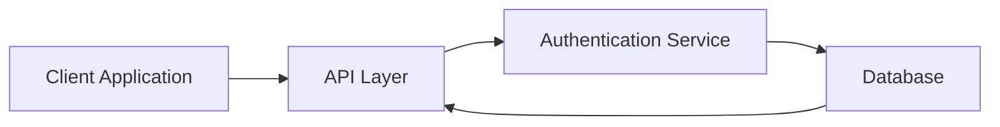
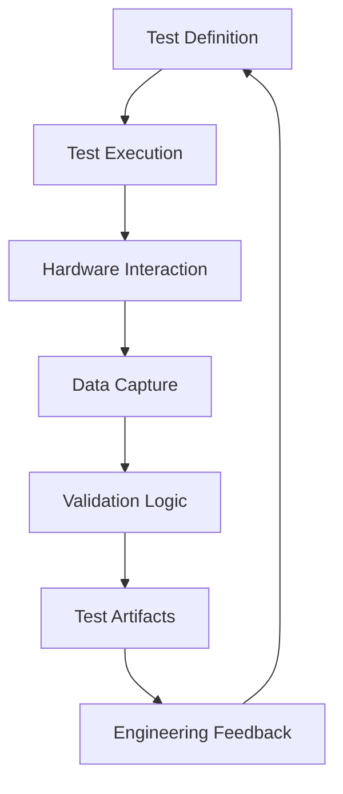

# Payam Adloo

Engineer focused on **hardware validation, embedded systems, and automated test infrastructure**.

Background in spacecraft battery production engineering and embedded system testing.  
Currently building tools that demonstrate how **Python automation interacts with embedded hardware systems**.

---

# Engineering Focus

- Embedded systems validation
- Firmware testing infrastructure
- Hardware communication protocols (UART / CAN)
- Python test automation
- Manufacturing test systems
- Backend API services

---

# System Architecture Focus

This workflow represents the architecture used across my validation frameworks.

Python test systems interact with embedded hardware through structured interface layers, allowing automated validation of firmware behavior and device responses.

---

# Key Projects

## STM32 Hardware Validation Framework

Python-based embedded validation environment demonstrating automated testing of an STM32 microcontroller using UART and CAN communication.

Repository:

https://github.com/piemasterflex111/stm32-hardware-validation-framework

---

## Spacecraft Test Automation Framework

Prototype infrastructure for automated validation workflows used in aerospace hardware test environments.

Repository:

https://github.com/piemasterflex111/spacecraft-test-automation-framework

---

## Manufacturing Data Automation

Tools for analyzing and automating manufacturing test data pipelines.

Repository:

https://github.com/piemasterflex111/manufacturing-data-automation

---

## Backend Auth System

Python backend service demonstrating authentication workflows and API infrastructure.

Repository:

https://github.com/piemasterflex111/backend-auth-system

---

# Validation Workflow Philosophy

The goal of automated validation systems is to create a **closed feedback loop between firmware behavior and engineering insight**.

---

# Current Focus

Developing validation frameworks that bridge:

- embedded firmware
- automated test infrastructure
- hardware communication interfaces
- structured validation artifacts

---

# Technologies

**Languages**

Python  
C/C++ (embedded firmware)

**Protocols**

UART  
CAN

**Tools**

PySerial  
python-can  
pytest  
FastAPI

---

# Contact

GitHub  
https://github.com/piemasterflex111
